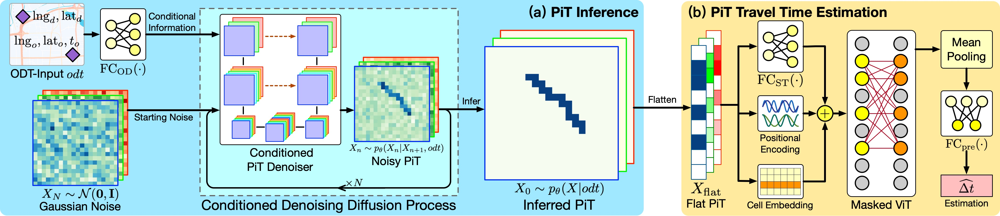

# Diffusion-based Origin-destination Travel Time Estimation

Codes and sample datasets for the model "Diffusion-based Origin-destination Travel Time Estimation (DOT)". Paper published on SIGMOD 2024.

> Yan Lin, Huaiyu Wan, Jilin Hu, Shengnan Guo, Bin Yang, Youfang Lin, Christian S. Jensen. Origin-Destination Travel Time Oracle for Map-based Services. The 50th ACM SIGMOD Conference on Management of Data, 2024.

Camera ready version of the paper will soon be released.

## Model overview



The DOT method follows a two-stage framework. The first stage is the PiT inference stage, and the second stage is the PiT travel time estimation stage.

In the PiT inference stage, we try to infer the PiT corresponds to a given ODT-Input. The ODT-Input is considered the conditional information incorporated into a conditioned PiT denoiser. 
The denoiser samples from standard Gaussian noise at the beginning. Then, it produces the inferred PiT conditioned on the ODT-Input through a multi-step conditioned denoising diffusion process.

In the PiT travel time estimation stage, we estimate the travel time based on the inferred PiT. The PiT is first flattened and mapped into a feature sequence to capture the global spatial-temporal correlation better. To improve the model's efficiency, we propose a Masked Vision Transformer (MViT) to estimate the travel time. 

## Training and evaluation pipeline

The `main.py` regulates the training and testing process of DOT. Parameters are given through command line arguments. For example, to train the model on `chengdu` dataset with $20\times20$-size grids for 20 epoches, you can run the following bash command:

```bash
python main.py --cuda 0 -n chengdu -s 20 --traindiff -e 50
```

Ungiven hyper-parameters are set to default values.

## Dataset and pre-process

The sample datasets are in the `/sample` directory. They share the same format as the full dataset, yet have a very small footprint, suitable for local debugging. You can also insert your own datasets following the same format. Notice that each dataset is a set of `pandas DataFrames` and stored in one `HDF5` file.

The `dataset.py` controls how the datasets are loaded and pre-processed. To pre-process a certain dataset, please regard the `dataset.py` as the main entry of Python. For instance, to pre-process the `chengdu` dataset into Pixelated Trajectory format with $20\times20$-size grids, you can run the following bash command:

```bash
python dataset.py -n chengdu -t image -s 20; 
```

